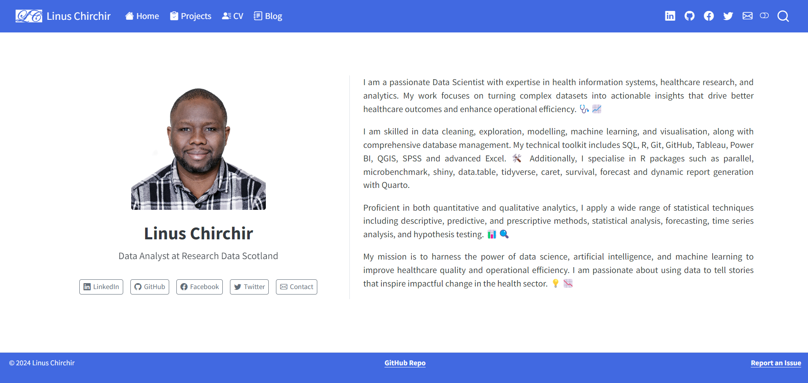

# Welcome to the Repo of Linus Chirchir's Personal Portfolio Website

This repository contains the source code and configuration for my personal portfolio website, [linuschirchir.com](https://linuschirchir.com), created with Quarto, hosted on GitHub Pages, and deployed via GoDaddy.



## Table of Contents

- [Introduction](#introduction)
- [Prerequisites](#prerequisites)
- [Installation](#installation)
- [Site Structure](#site-structure)
- [Customisation](#customisation)
- [Setting Up Your Custom Domain with GoDaddy](#setting-up-your-custom-domain-with-godaddy)
- [License](#license)

## Introduction

This repository is the foundation of my personal portfolio website, where I share insights and projects related to data science, artificial intelligence, machine learning, and health information systems. It includes sections such as my blog, professional CV, and various projects that I have worked on. The website is built using the [Quarto](https://quarto.org) framework, hosted on GitHub Pages, and uses a custom domain, [linuschirchir.com](https://linuschirchir.com), deployed via GoDaddy.

## Prerequisites

Before getting started, ensure you have the following installed:

- **Quarto**: The website is built using Quarto. You can download it from the [official site](https://quarto.org/).
- **Git**: To clone this repository and manage version control.
- **Web Browser**: To view the rendered site locally.

## Installation

To run this project locally, follow these steps:

1. Clone the repository:
   ```bash
   git clone https://github.com/linuschirchir/linuschirchir.github.io.git
   cd linuschirchir.github.io
   ```

2. Install Quarto on your system. Follow the instructions on the [Quarto website](https://quarto.org/docs/get-started/).

3. Render the site locally:
   ```bash
   quarto render
   ```

4. Open the generated `_site/index.html` file in your browser to view the site.

## Site Structure

The main files and directories of this repository include:

- **_quarto.yml**: The primary configuration file for the site. It includes site metadata, navigation setup, and layout configuration.
- **CNAME**: The custom domain configuration for GitHub Pages, pointing to [linuschirchir.com](https://linuschirchir.com).
- **about.qmd**: Quarto markdown file for the "About Me" page.
- **blog.qmd**: Section for blog posts, which are rendered using Quarto.
- **cv.qmd**: Contains my professional CV.
- **projects.qmd**: Details on various data science and AI projects.
- **images/**: Directory containing images used across the site.
- **styles.css**: Custom styles for personalising the website's appearance.
- **dark.scss & light.scss**: SCSS files to manage both light and dark themes.

## Customisation

You can customise various aspects of the site:

- **Theme**: Modify the `styles.css` or SCSS files to change the light and dark themes.
- **Content**: Update the Quarto markdown files (`.qmd`) to add or modify content such as blog posts, projects, or the CV.
- **Domain Setup**: The `CNAME` file points the website to the custom domain. If you are forking or adapting the repository, update the CNAME file to your own domain.

## Setting Up Your Custom Domain with GoDaddy

If you're using GoDaddy for your custom domain and hosting your Quarto site on GitHub Pages, follow these steps:

### Step 1: Set Up Your Quarto Site on GitHub Pages
Make sure your Quarto site is set up and deployed on GitHub Pages:

1. Push your Quarto site to a GitHub repository.
2. Go to the repository settings.
3. Under the "Pages" section, set your source to the correct branch (often `main` or `gh-pages`) and the root directory or `/docs`.

### Step 2: Purchase or Access Your Domain in GoDaddy
Ensure you have a domain name registered with GoDaddy. If you haven't done this yet, you can purchase a domain via GoDaddy.

### Step 3: Update GitHub Repository for Custom Domain
1. In your GitHub Pages repository, create a `CNAME` file in the root of the repository (if it doesn't exist) and add your domain (e.g., `www.linuschirchir.com`) inside it.
2. Commit and push the `CNAME` file to your repository.

### Step 4: Configure DNS Settings on GoDaddy
To point your domain to GitHub Pages:

1. Log in to your GoDaddy account.
2. Navigate to "My Products" and find the domain you want to use.
3. Click "DNS" next to your domain name to access DNS Management.
4. Set the DNS records:
   - **A Record**: Point to GitHub Pages IP addresses:
     - `185.199.108.153`
     - `185.199.109.153`
     - `185.199.110.153`
     - `185.199.111.153`
   - **CNAME Record**: Point `www` to `<username>.github.io`.

### Step 5: Wait for DNS Propagation
The DNS changes may take a few minutes to a few hours to propagate.

### Step 6: Verify Custom Domain in GitHub
Go to your repository settings and confirm that your custom domain is set under the GitHub Pages section. GitHub will handle the SSL certificate automatically.

Now, your Quarto website hosted on GitHub Pages should be accessible via your custom GoDaddy domain!

## License

This project is licensed under the MIT License. You are free to use, modify, and distribute it as long as proper attribution is provided. See the `LICENSE` file for more information.

---

Happy browsing!  
**Linus Chirchir**  
[Visit My Website](https://linuschirchir.com)
```

This README.md provides an overview of the project, including the file structure, instructions for running the project locally, and details on using a custom domain with GitHub Pages and deploying via GoDaddy. Feel free to reach out if you need further customisation!
